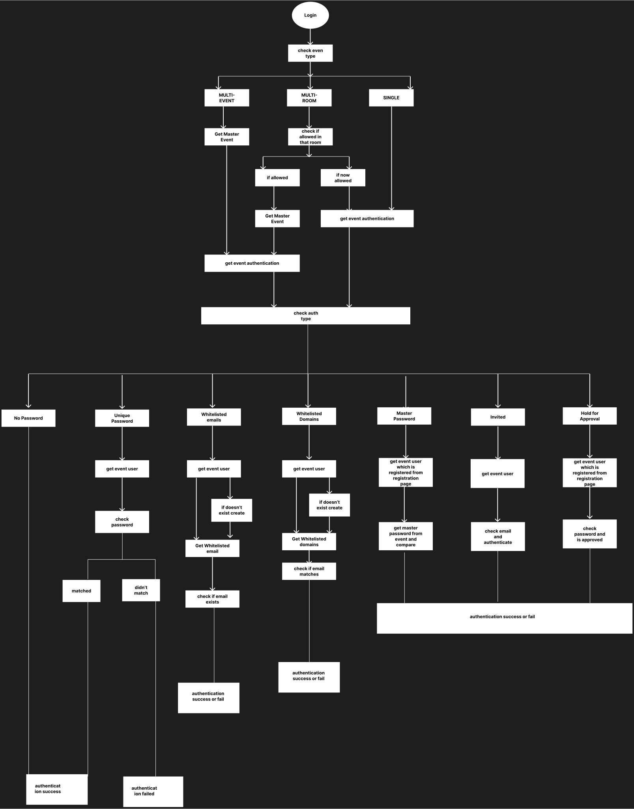
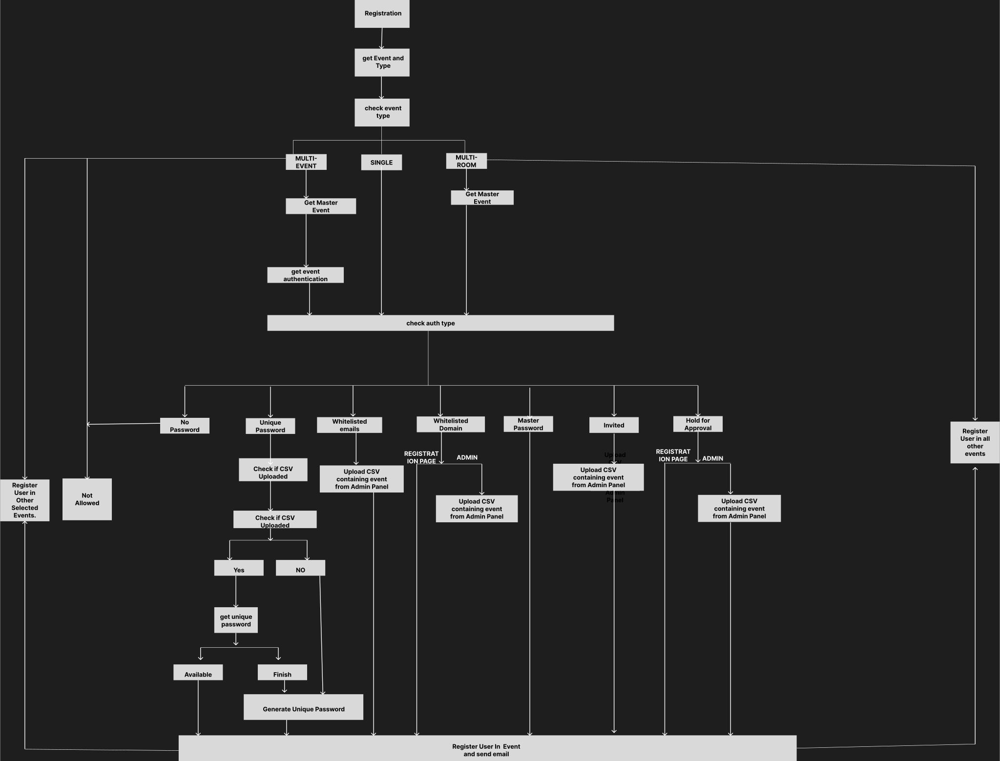

Tech Stack: **NestJs(Backend), PostgreSQL(Database), NextJs(Frontend), Socket.IO, Redis(Caching and Pub/Sub)**

Principles: **Clean Architecture, Event Driven Architecure, Strategy Pattern, Factory Pattern**

An event management web app where admin manage an event simple right? -- well it's not.
The structure is more complex than it seems. A superadmin oversees multiple admins,
each of whom can manage several events. Every event may have distinct registration page,
registration type, and event page. Additionally, events can include public chat, tech support,
collaborators, polling and their own users. Furthermore, there can be multiple types of event.
Breaking this system into smaller, manageable components was a significant challenge.

---

## Event Authentication Types
**a. Master Password:**
    All users are provided with the same password. They must use this password to view event.

**b. Unique Password:**
   Each user receives a unique password during registration. This ensures individual access control per user.

**c. No Password:**
   Users can access the event without providing any password.

**d. Whitelisted Emails:**
   Only users with email addresses that are explicitly whitelisted are allowed to enter the event.

**e. Whitelisted Domains:**
   Only users with email addresses from approved domains (e.g., emails ending in .au) are allowed to access the event.

**f. Invited:**
   The event admin and moderators manually select users and send invitations. Only invited users can access the event.

**g. Hold For Approval:**
   Users can register freely, but must wait for approval from the admin. Once approved, they are granted access to the event.

## Event Types
**a. Multi Event:**
    In a multi-event type, the registration page is mandatory. This page displays multiple events that have been configured by the admin. Users can select the events they wish to attend and complete the registration process. Once registered, users can view the selected events and switch between them as needed. Each event have their own configuration for features such as polls, chats and more. However, authentication type inherited from master event.

**b. Multi Room:**
    In a multi-room type, there is a concept of a master event. All other events inherit the configuration of the master event, except for the video content that will be played. This allows for a consistent experience across all rooms while enabling each room to deliver unique video material.

**c. Single Event:**
    It is a single independent event that has its own configuration.

---
## how auth flow is handled according to event and authentication type.
I made a flow diagram for both login and registration lets go one by one. I used strategy pattern for it in code.

### a. Login Flow

**Explaination:**
The figure is self-explanatory, so I will briefly summarize what's happening. 
Whenever user attempts to log in, the system first checks event type to determine whether it is single-event, multi-event or multi-room. Based on the event type, the system retrieves the corresponding authentication configuration. In case of a single-event, the configuration is fetched directly fromt he event itself. However, for multi-event and multi-room types, the configuration is inherited from the master event. After retrieving the appropriate configuration, the system applies the strategy pattern to handle authentication.

### b. Registration Flow

**Explaination:**
The registration flow is similar to login process. Just like in login flow, the system first determines event type, then retrievies its corresponding authentication configuration. Based on this configuration, the system registers the user and sends an email accordingly.