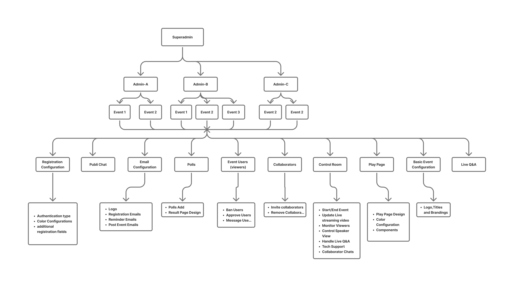
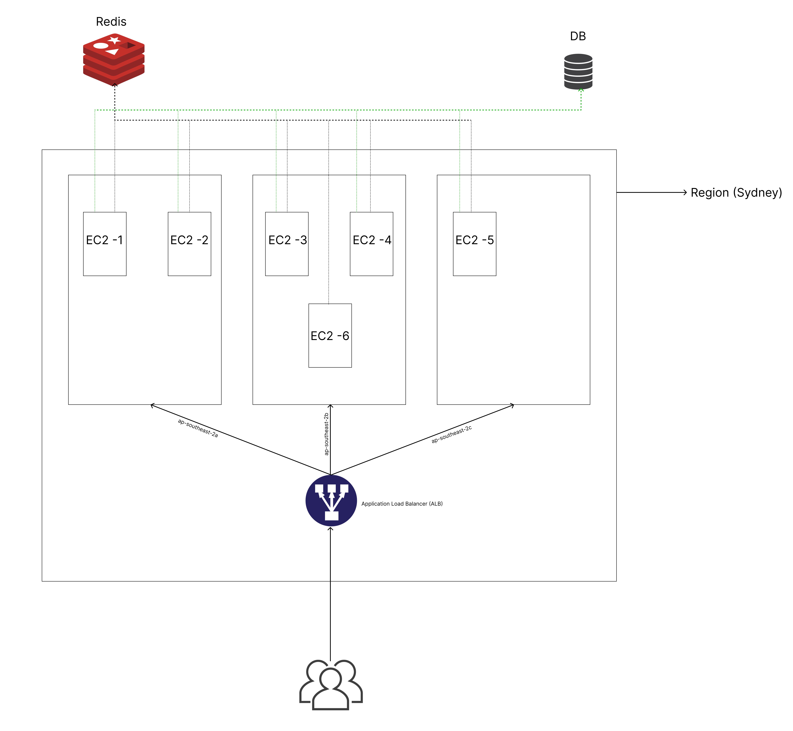
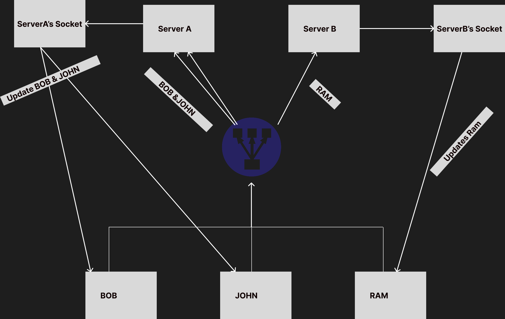
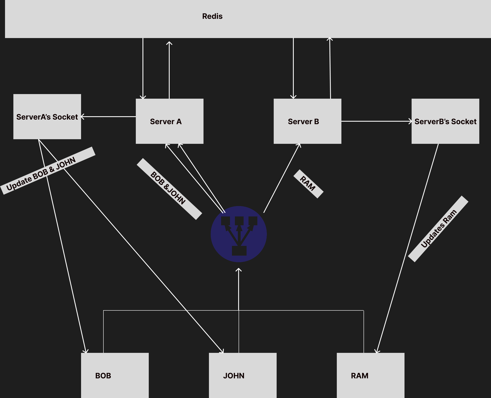

## **Overall Hierarchy**

As we can see, the overall hierarchy revolves around the concept of an **event**. Features such as public chat, polls, control room, dynamic emails, dynamic registration, and play pages already introduce significant complexity.

At first glance, it might seem that the most difficult parts are **building the dynamic email templates**, registration pages, play pages, or implementing authentication and authorization. However, the most **challenging part was actually** **designing database**, **backend structure**, **writing manageable**, **maintainable**, and **bug-free** code.

One key complexity was ensuring proper **separation of real-time features** — for example, the public chat of Event A should never interfere with that of Event B.

For this project, I used **Socket.IO**. I chose **Socket.IO over raw WebSockets** because managing all connected users, namespaces, and rooms manually would have added unnecessary overhead. Socket.IO offers built-in support for namespaces and rooms, which made implementing real-time features much simpler and more efficient.
## **Hosting**
The hosting setup is relatively simple. We use a single instance of **Redis** and a single instance of
**PostgresSQL**. Multiple backend server are deployed, each connected to both Redis and PostgresSQL.
**Nginx** acts as both proxy and load balancer so, Nginx will distribute incoming requests to the backend
servers using a round-robin strategy. **Docker** is used to spin up multiple backend instances.
### **Nginx and Docker Hosting**

If I were to use aws for hosting, the architecture would be slightly different. I initially deployed it in aws but quicky switched to current setup because of cost constraints. On AWS, I would use an **Auto Scaling Group** in combination with a **Launch Template** and an **Application** **LoadBalancer (ALB)** to enable horizontal scaling of EC2 instances. Here, I used cpu usage to autoscale. If usage is more than 60% create new instance.

### **AWS Hosting**

## **Socket Horizontal Scaling**
Multiple instances of server has been hosted and hosting architecture is also solid so good to go yes?. Well it's not. One of the major issues I encountered was with socket scaling. When multiple server instances are running, the load balancer randomly selects one instance and routes the socket connection to that server. As a result, users connected to that specific
server receive live updats, but only for activities occuring on that instance. There is no shared socket state across instances, which leads to inconsistent real-time behaviour for users connect to different servers. 

For example, let’s say there are two server instances — ServerA and ServerB — and three users: Bob, John, and Ram.
When Bob and John open the same event URL in their browser, the loadbalancer routed them in ServerA. However for Ram for that same url, he was routed to ServerB.
Now, suppose the event has public chat enabled.  If Bob sends a message in the public chat, John (who is on the same server) will receive the message live. But Ram, who is connected to a different server, won’t see the update unless he refreshes the page.
The same issue happens in reverse — if Ram sends a message, Bob and John won’t be updated in real time.

Let me show you a diagram.

To circumvent this problem, I used Redis Pub/Sub. A single Redis instance was set up, and all server instances subscribed to a common Redis channel for socket events.

Now, when a user sends a message, the server publishes that message to Redis. Redis then broadcasts it to all subscribed server instances. Each server receives the message and updates its connected users accordingly.

As a result, all users—regardless of which server instance they are connected to—receive real-time updates consistently.

The diagram will look like as follow for this approach.

