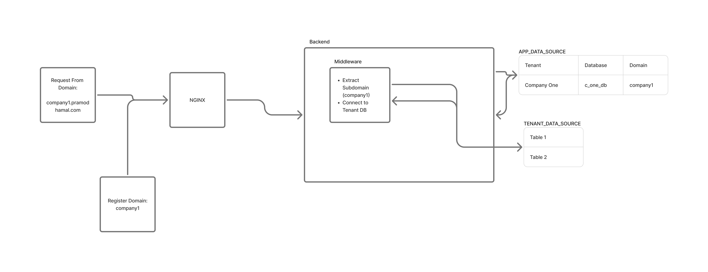

Tech Stack: **NestJs(Backend), PostgreSQL(Database), NextJs(Frontend), Redis (Caching)**

This is essentially a project management app. While it’s not fully complete, I’m including it here because I want to share how I implemented **domain-based multi-tenant SaaS**. The backend is already configured to support a **multi-tenant architecture based on custom domains**, and it’s working as expected. I’d like to explain the approach I took to make this work. Although I originally referred to a few online articles for guidance, it’s been a while and I no longer remember the exact sources — otherwise, I would have credited them here.

Let's dive into the topic.

First, I created a main database to **manage tenant information and their corresponding databases**. Whenever a new tenant registers in the system, a record is created in this main database containing details such as the subdomain name, database name, branding, and other metadata. Along with this, a separate database is created for the tenant, ensuring **complete data isolation**.

To manage this setup, I defined two types of data sources:

**APP_DATA_SOURCE** — the main database that stores global tenant metadata

**TENANT_DATA_SOURCE** — the tenant-specific database where all application data resides

Now, one of the challenges was that we **can't connect to all tenant databases during application boot** — that would be inefficient and unnecessary. However, we must connect to the main (APP) database during boot to retrieve tenant configuration. That’s exactly what I implemented.

I built a middleware that extracts the subdomain name from either the request headers or the host. Based on this subdomain, the middleware dynamically establishes a connection to the corresponding tenant database. I allowed **two options** for **subdomain detection** — from the **Host header** and from a **custom header** — because during development (e.g., on localhost) it's not possible to get real subdomains.

With the dynamic database connection logic in place, the next step was hosting. This part is relatively straightforward:

I created a **wildcard A record** pointing to the server’s IP.

On the server, I configured Nginx to proxy incoming requests based on subdomain routing, forwarding them to the backend application accordingly.

The exact thing in diagram will look like as:
